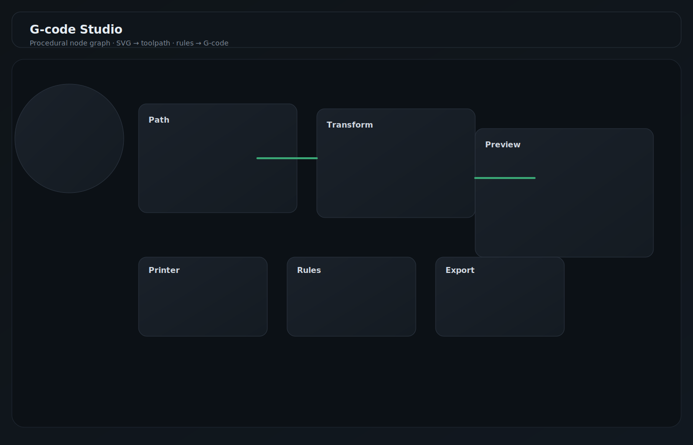
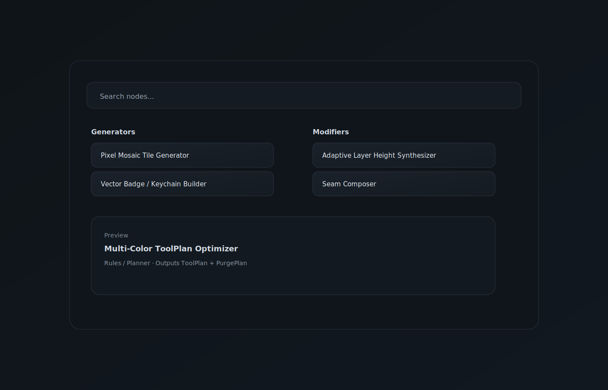

# G-code Studio Reader

## Overview
G-code Studio is a node-graph workspace for building toolpaths, rules, and printer output in a FullControl-inspired procedural workflow. It combines a searchable node library, a graph canvas, and a preview panel so you can move from SVG or mesh inputs to G-code exports in one flow. The node catalog spans generators, modifiers, planners, analyzers, and visualizers so you can assemble end-to-end pipelines inside a single graph.


## Screenshots




## Quick start
1. Launch the app (served by `server.js` or the launch scripts below).
2. Press **Space** to open the node picker and add nodes.
3. Wire nodes from left to right: **Path → Modifiers → Rules → Printer → Export**.
4. Click **Run graph** to generate toolpaths and preview them.
5. Use **Download .gcode** to export the output.

## Launch scripts
- **macOS:** `./launch-macos.sh`
- **Windows:** `launch-windows.bat`

Both scripts start the local server and print the URL to open in your browser.

## Slicer nodes & engine setup
G-code Studio includes slicer nodes that call external slicer engines on the server. Ensure the CLI binaries are installed and accessible on the machine running `server.js`.

### Supported slicer nodes
- **CuraEngine** slicer node
- **PrusaSlicer** slicer node

### Engine setup requirements
- Install CuraEngine (from Ultimaker Cura or CuraEngine builds) and/or PrusaSlicer.
- Confirm the CLI executable is available on the host (e.g., `CuraEngine` / `curaengine`, `prusa-slicer`).
- Configure the server-side CLI paths (see below) so the slicer nodes can invoke them.

### Configure server-side CLI paths
Set the CLI paths in your server environment so `server.js` can locate the binaries:
- `CURAENGINE_PATH` — absolute path to the CuraEngine executable.
- `PRUSASLICER_PATH` — absolute path to the PrusaSlicer executable.

Example (macOS/Linux):
```bash
export CURAENGINE_PATH="/Applications/Ultimaker Cura.app/Contents/Resources/CuraEngine"
export PRUSASLICER_PATH="/Applications/PrusaSlicer.app/Contents/MacOS/PrusaSlicer"
```

Example (Windows PowerShell):
```powershell
setx CURAENGINE_PATH "C:\Program Files\Ultimaker Cura\CuraEngine.exe"
setx PRUSASLICER_PATH "C:\Program Files\PrusaSlicer\prusa-slicer.exe"
```

## Licensing & WASM assets
- G-code Studio includes AGPL-licensed components. If you deploy or redistribute the app, ensure your distribution complies with AGPL requirements (including source availability for network use).
- If a slicer node depends on a WASM build, place the WASM assets under `public/` (for example, `public/wasm/`) so they are served by `server.js` and reachable by the client.

## Settings
Open **Settings** in the top bar to personalize the workspace.

### Layout & picker behavior
- **Show Node Library sidebar** toggles the left panel.
- **Space opens Node Picker** enables the quick-add menu.
- **Open picker while typing** allows Space to open the picker even when a text input is active.
- **Picker delay** adjusts the key-hold delay before opening the picker.
- **Spawn at cursor** controls whether nodes appear under your pointer or in the canvas center.

### Debug mode
- **Debug mode** shows node IDs and a live **Debug** pill in the top bar with node/link counts.
- Use this when troubleshooting graphs or reporting issues.

### Connection style
Choose how links are drawn between nodes:
- **Curved** (default) for a smooth Bezier path.
- **Straight** for a direct line.
- **Orthogonal** for right-angle routing.

## Keyboard shortcuts
| Action | Shortcut |
| --- | --- |
| Open node picker | **Space** |
| Pan canvas | **Space + Drag** |
| Pan canvas | **Middle Drag** |
| Zoom | **Wheel** |
| Run graph | **G** |
| Delete selected node | **Del** |
| Close dialogs | **Esc** |

## Output & preview
- The right panel previews paths, mesh output, and gcode statistics.
- Use **Fit preview** to frame the latest toolpath.
- The HUD shows point count, length, extrusion, and estimated time.

## Tips
- Use the **Global Params** panel to define reusable constants.
- Hover inputs for hints, and keep nodes organized by grouping related operations.
- Combine **Rules** nodes with **Export** to fine-tune printer behavior.

## Troubleshooting
- If you see no output, ensure an **Export** node is connected to a valid toolpath.
- If links look too busy, switch to **Straight** or **Orthogonal** connection style.
- Toggle **Debug mode** to verify node IDs and link counts.

## Project layout
- `public/index.html` — main UI, graph editor, and styling.
- `public/app-core.js` / `public/app-runtime.js` — core app logic and runtime behavior.
- `public/app-schemas.js` — shared schema constants for node UIs.
- `public/nodes/` — per-node definitions.
- `server.js` — lightweight local server for the app.
